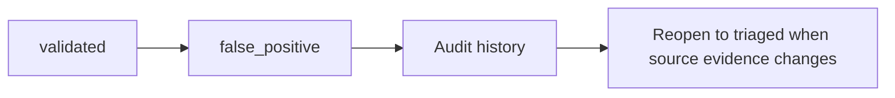

# False Positive Governance

False positives are terminal controlled outcomes. They require rationale and reviewer evidence, and they remain visible in:

- `outputs/security/lifecycle/false-positive-register.csv`
- `outputs/security/lifecycle/vulnerability-register.json`
- `reports/security/vulnerability-lifecycle-report.md`

False positives are separate from scanner suppressions and security exceptions.
