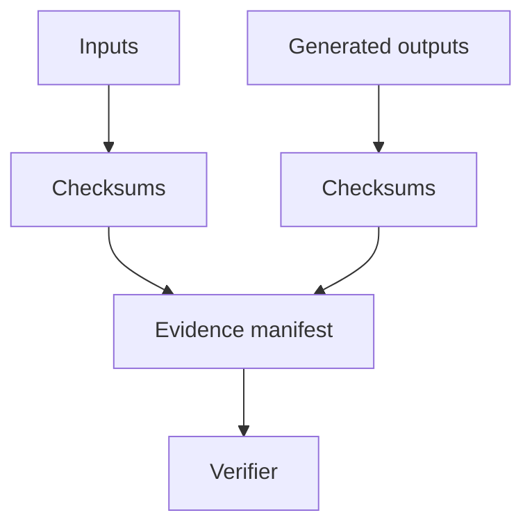

# Findings Evidence

Generated outputs live under `outputs/security/findings/`.

The evidence manifest records schema version, project version, controlled timestamp, as-of date, input checksums, output checksums, adapter versions, config versions, normalisation count, deduplication count and deployment status.

Verify with:

```bash
make verify-findings-evidence
```


