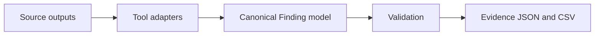

# Findings Normalisation

Adapters are implemented for threat model residual risks, Gitleaks, Semgrep, Bandit, pip-audit, Checkov, Trivy, Schemathesis, OWASP ZAP, dynamic pytest security tests and suppression registers.

Clean tools still appear in findings summaries with a zero count. Suppressed source findings remain visible as canonical records with suppression metadata and compensating controls.

