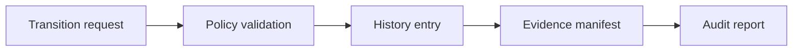

# Lifecycle Audit

Lifecycle history entries are immutable event records with role actors rather than personal identifiers.

Each event includes:

- `event_id`
- `vulnerability_id`
- `event_type`
- `from_status`
- `to_status`
- `actor_role`
- `reason`
- `timestamp`
- `evidence_reference`
- `metadata`

The audit report is `reports/security/lifecycle-audit-report.md`.
