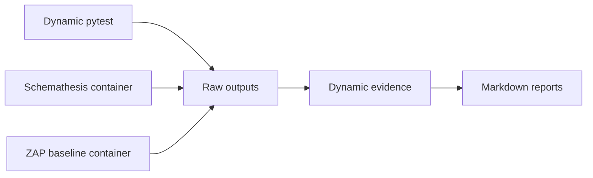

# Local Dynamic Security Workflow



Run the full workflow with:

```bash
make dynamic-full
```

The workflow starts the API on `127.0.0.1`, scans through approved local targets only, stops the server after scanner execution and verifies the evidence manifest.
