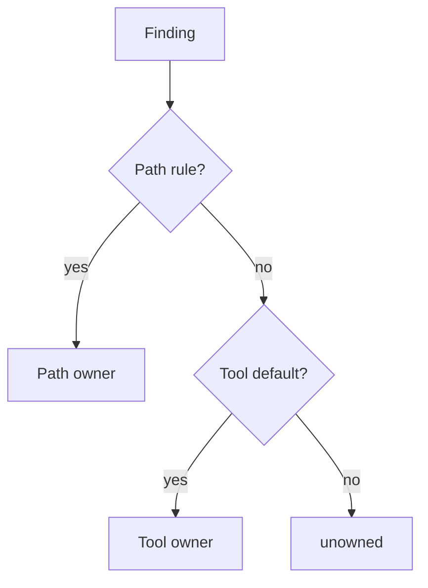

# Ownership Assignment

Ownership rules are configured in `config/findings/ownership.yaml`.

Rules use repository paths and source-tool defaults to assign:

- squad
- technical owner
- risk owner
- remediation owner

Owners are role-based portfolio groups only. Personal email addresses are not used. Unmatched findings are marked `unowned` and written to `unowned-findings.csv`.

