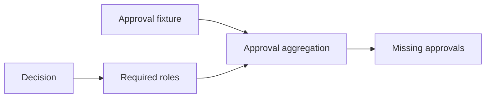

# Release Approvals

Conditional release decisions list required approval roles in `required-approvals.json`.

Approval fixtures live in `config/release/fixtures/`:

- `no-approvals.yaml`
- `partial-approvals.yaml`
- `complete-approvals.yaml`
- `invalid-approval-role.yaml`
- `approval-not-required.yaml`

These fixtures are local validation inputs. They are not a production approval workflow.

