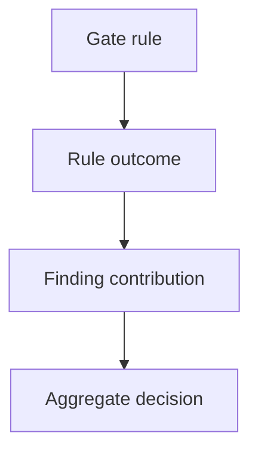

# Release Decision Model

The release decision model records:

- stable `decision_id`
- policy version
- findings input checksum
- evaluated finding count
- blocking, conditional and warning finding IDs
- matched and unmatched rules
- required approvals
- required actions
- rationale and limitations

Rule outcomes are `matched`, `not_matched`, `not_applicable`, `suppressed` and `deferred`.

