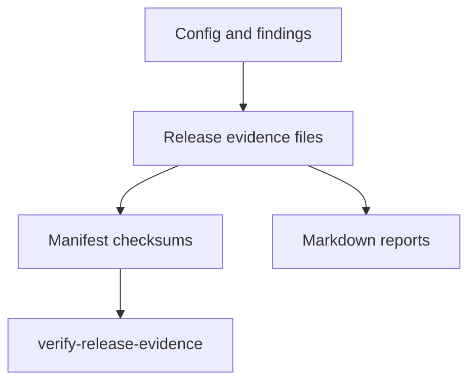

# Release Evidence

Release evidence is written under `outputs/security/release/`.

Files:

- `release-gate-decision.json`
- `finding-evaluations.json`
- `matched-rules.json`
- `release-actions.json`
- `required-approvals.json`
- `release-risk-summary.json`
- `policy-validation-summary.json`
- `evidence-manifest.json`

Reports:

- `release-assurance-report.md`
- `release-gate-report.md`
- `release-risk-report.md`
- `release-actions-report.md`

