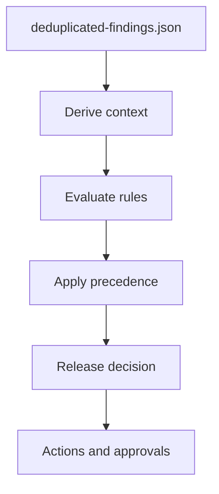
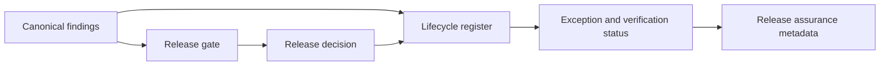

# Release Gates

Release gates evaluate canonical findings and produce one release decision: `pass`, `conditional_pass`, `warn` or `block`.

Decision precedence is `block`, then `conditional_pass`, then `warn`, then `pass`.

Evidence mode writes decision evidence regardless of the decision. Enforcement mode maps the decision to a process exit code.

Milestone 9 lifecycle evidence consumes release outputs and exposes lifecycle metadata back to release assurance consumers:

Lifecycle evidence does not change the Milestone 8 release gate decision engine. It records vulnerability status, exception status, expiry, owner, overdue state and verification state for audit and downstream review.
