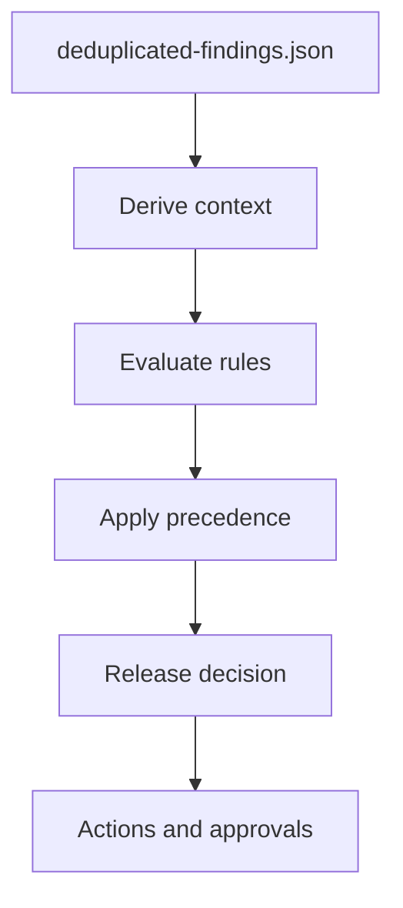

# Release Gates

Release gates evaluate canonical findings and produce one release decision: `pass`, `conditional_pass`, `warn` or `block`.

Decision precedence is `block`, then `conditional_pass`, then `warn`, then `pass`.

Evidence mode writes decision evidence regardless of the decision. Enforcement mode maps the decision to a process exit code.
