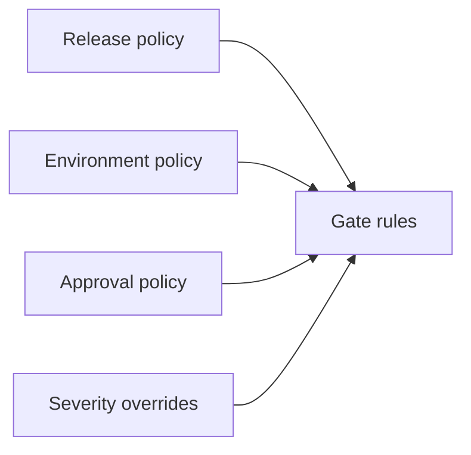

# Release Policy

Release policy lives under `config/release/`.

- `release-policy.yaml` defines policy version, deterministic timestamp defaults and decision precedence.
- `gate-rules.yaml` defines match conditions, decisions, required approvals, actions and rationale templates.
- `environment-policy.yaml` defines local environment handling and confirms no deployment occurs.
- `approval-policy.yaml` defines approved release-assurance roles.
- `severity-overrides.yaml` is reserved for controlled severity override policy.



Validate policy with:

```bash
make release-policy-validate
```
