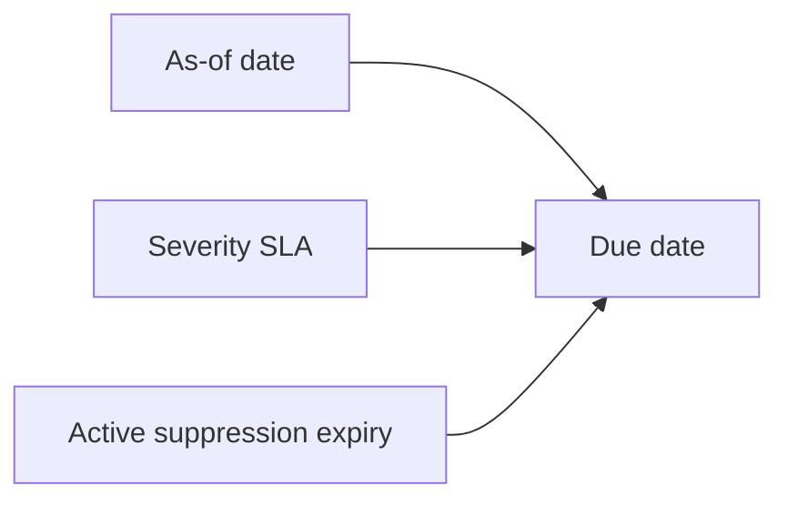

# Remediation SLA

The SLA model is configured in `config/findings/remediation-sla.yaml`.

Portfolio demonstration values:

| Severity | SLA |
| --- | ---: |
| critical | 3 days |
| high | 14 days |
| medium | 30 days |
| low | 60 days |
| informational | 90 days |

These are repository demonstration values, not Genomics England policy. Due dates derive from the controlled `FINDINGS_AS_OF_DATE` equivalent used by `make findings-full`.

