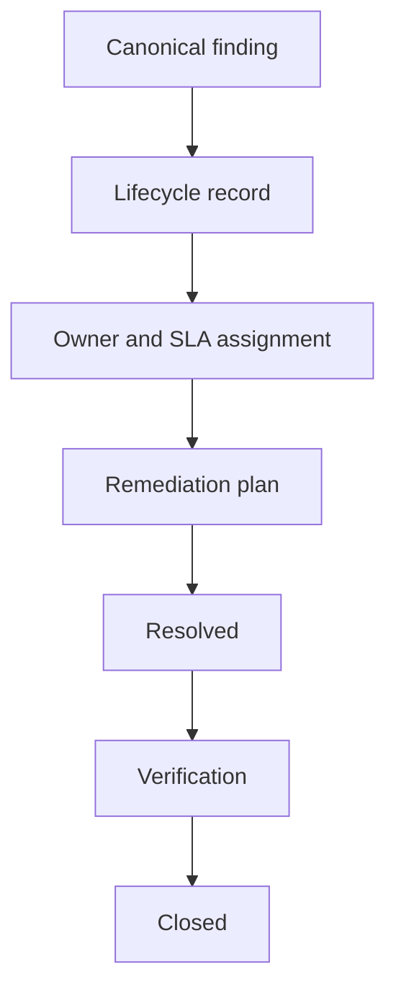

# Remediation Workflow

Remediation starts from the vulnerability register generated from canonical findings:

```bash
make lifecycle-initialise
make lifecycle-validate
```

Owners, SLA dates and priorities come from findings enrichment. Scanner suppressions remain visible as scanner governance metadata; they do not become formal lifecycle exceptions.



The local implementation is file-backed and deterministic. It is not a ticketing system.
