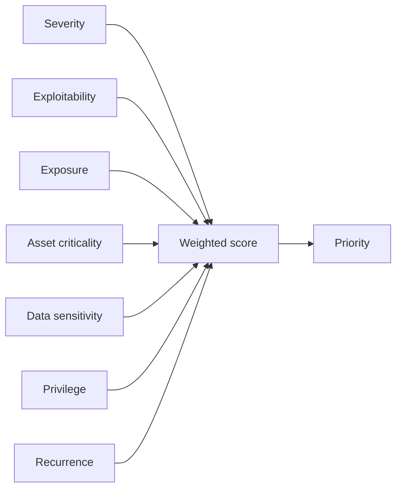

# Risk Enrichment

Risk scores are transparent and deterministic:

```text
30% technical severity
20% exploitability
15% internet exposure
15% asset criticality
10% data sensitivity
5% privilege required
5% age or recurrence
```

Scores range from 0 to 100 and map to P1-P5 priorities. Suppression does not erase risk; suppressed records still receive scores.


