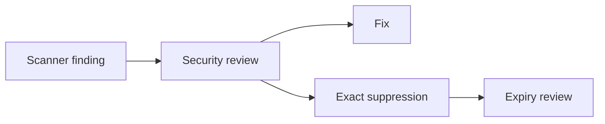

# Scanner Suppressions

Suppressions are governed in `security/config/suppressions.yaml`.

Required fields include tool, rule, exact scope, reason, owner, approver, created date, expiry date, compensating control and active status.

Wildcards are rejected by tests. Active suppressions must not be expired. Broad tool-level or repository-level suppressions are not used.

