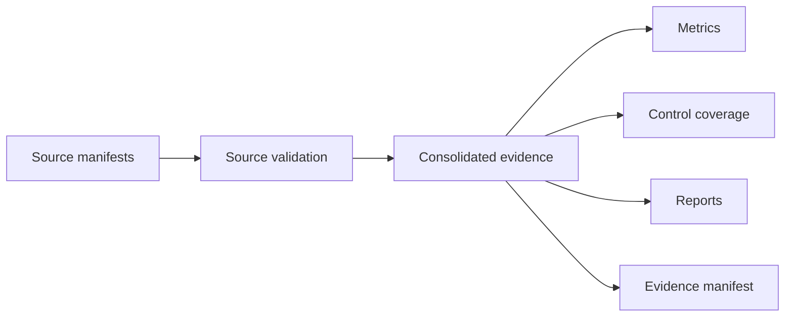

# Security Evidence Model

The consolidated evidence bundle is generated with:

```bash
make evidence-full
```



The model records source manifests, checksums, domains, release decision, finding counts, lifecycle counts, exception counts, verification counts and limitations. It is local portfolio evidence, not production certification.
