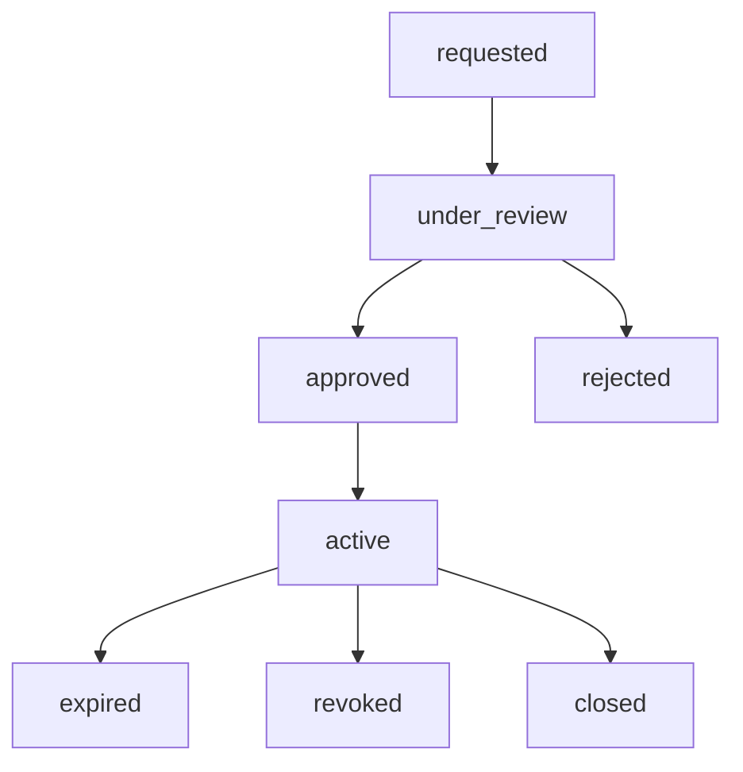

# Security Exceptions

Risk acceptance and deferral require formal, time-bound exceptions. Exceptions are governed by `config/lifecycle/exception-policy.yaml`.

Approval roles:

- Critical: Product Security, Risk Owner and Technical Owner.
- High: Product Security and Risk Owner.
- Medium: Product Security or Risk Owner.
- Low and informational: Technical Owner.

Maximum durations:

- Critical: 14 days.
- High: 30 days.
- Medium: 90 days.
- Low and informational: 180 days.

Scanner suppressions are not formal exceptions.
