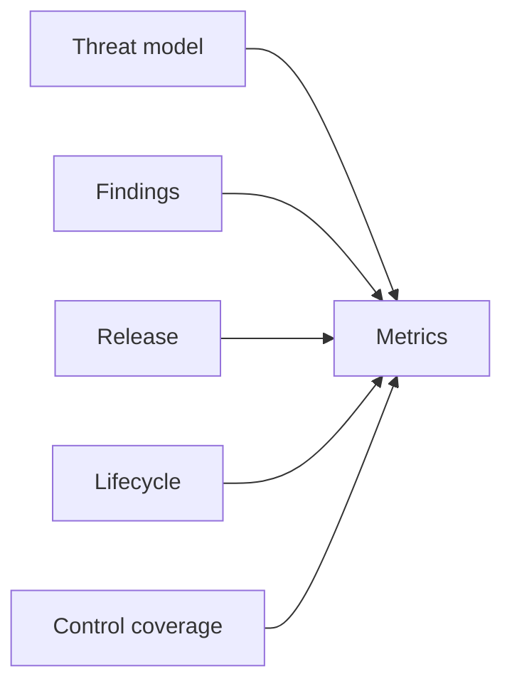

# Security Metrics

Metric definitions live in `config/evidence/metric-definitions.yaml`.

Metrics include threats, security requirements, scanner tools, findings, release decision, lifecycle status, exceptions, verification records, control coverage and evidence-domain verification. Percentages define their numerator and denominator in configuration.
