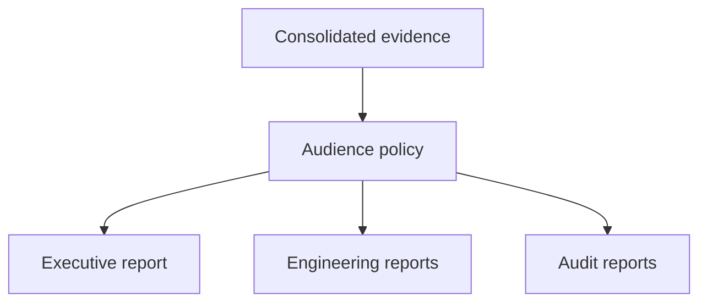

# Security Reporting

Reports are generated with:

```bash
make evidence-report
```


```mermaid
flowchart TD
    A["Consolidated evidence"] --> B["Audience policy"]
    B --> C["Executive report"]
    B --> D["Engineering reports"]
    B --> E["Audit reports"]
```

Reports derive counts from machine-readable evidence. They are not manually maintained.
