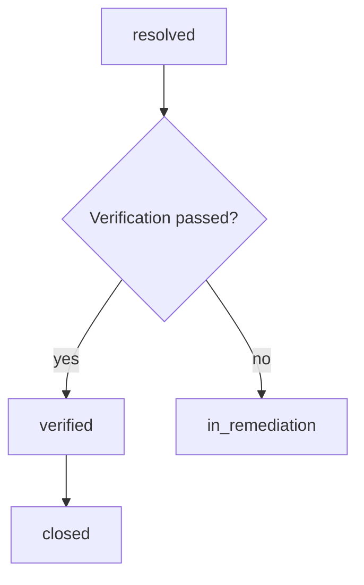

# Verification Before Closure

Closure requires passed verification evidence and closure evidence. A resolved vulnerability cannot move directly to closed.

Critical and high findings require an independent verifier role according to `config/lifecycle/verification-policy.yaml`.

Verification records are exported to `outputs/security/lifecycle/verification-register.json`.
