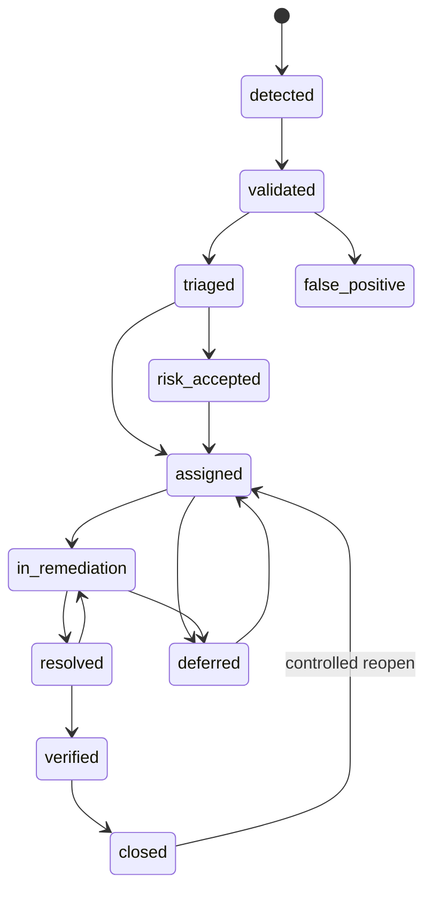

# Vulnerability Lifecycle

The lifecycle register is generated from canonical findings and release evidence:

```bash
make lifecycle-full
```



Direct `detected` to `closed` and `resolved` to `closed` transitions are rejected. Critical and high findings require owners before assignment or remediation.

Lifecycle evidence is deterministic and uses controlled timestamps from `LIFECYCLE_AS_OF_DATE` and `EVIDENCE_TIMESTAMP` when provided.
