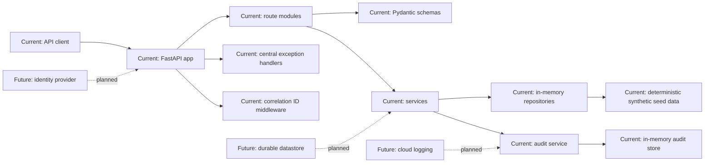

# Architecture

```mermaid
flowchart LR
    Client["Current: API client"] --> API["Current: FastAPI app"]
    API --> Routes["Current: route modules"]
    Routes --> Schemas["Current: Pydantic schemas"]
    Routes --> Services["Current: services"]
    Services --> Repos["Current: in-memory repositories"]
    Services --> Audit["Current: audit service"]
    Audit --> AuditRepo["Current: in-memory audit store"]
    Repos --> Seed["Current: deterministic synthetic seed data"]
    API --> Errors["Current: central exception handlers"]
    API --> Correlation["Current: correlation ID middleware"]
    FutureIdP["Future: identity provider"] -. planned .-> API
    FutureStore["Future: durable datastore"] -. planned .-> Services
    FutureLogs["Future: cloud logging"] -. planned .-> Audit
```

Current components are implemented in Milestone 1. Future components are architectural context only.
