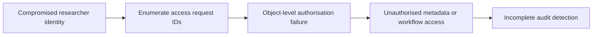
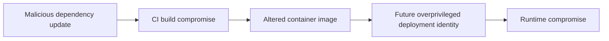
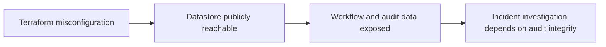

# Attack Paths

## Compromised Researcher Identity

Mapped threats: `THR-AUTH-001`, `THR-AUTHZ-001`, `THR-API-003`, `THR-AUDIT-001`.

## Malicious Dependency Update

Mapped threats: `THR-SUPPLY-001`, `THR-SUPPLY-002`, `THR-SUPPLY-003`, `THR-CI-001`, `THR-IAM-001`.

## Future Public Datastore Exposure

Mapped threats: `THR-IAC-001`, `THR-IAC-002`, `THR-IAM-002`, `THR-AUDIT-001`.
