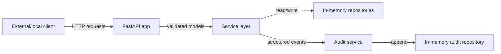
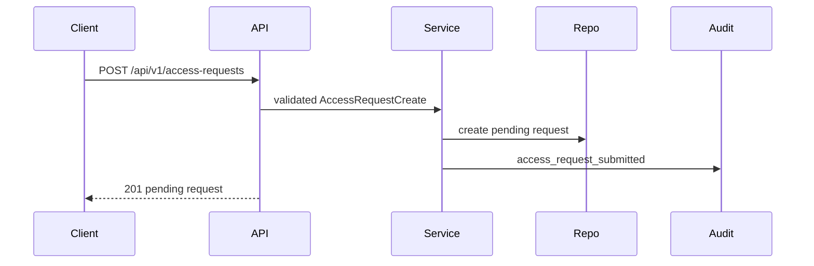
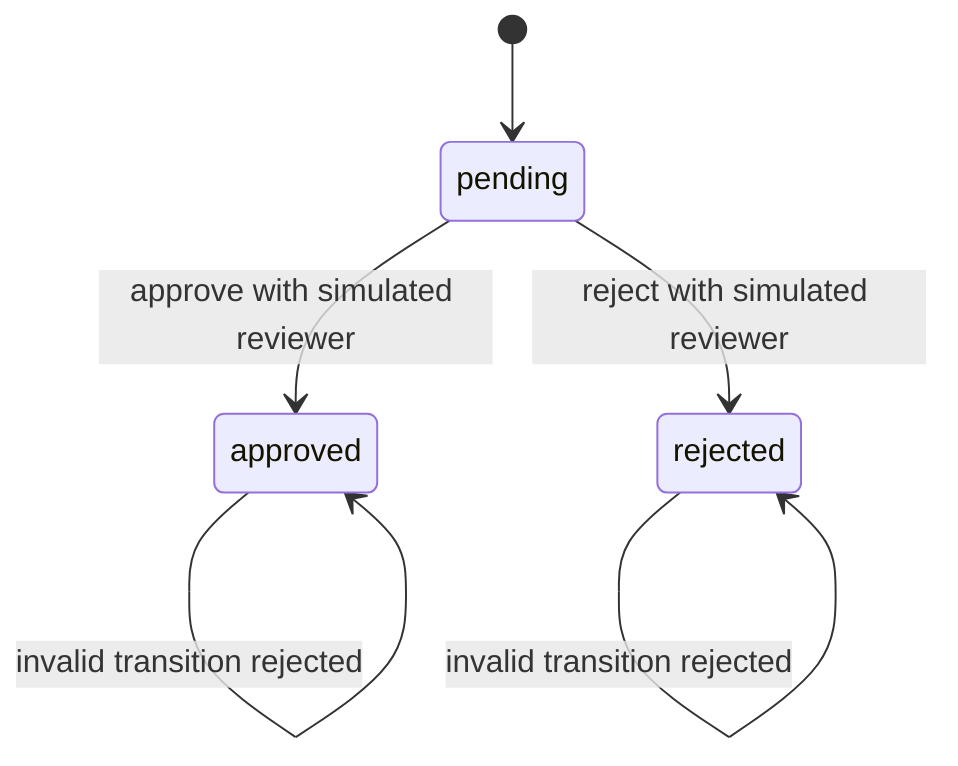
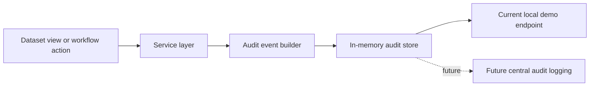
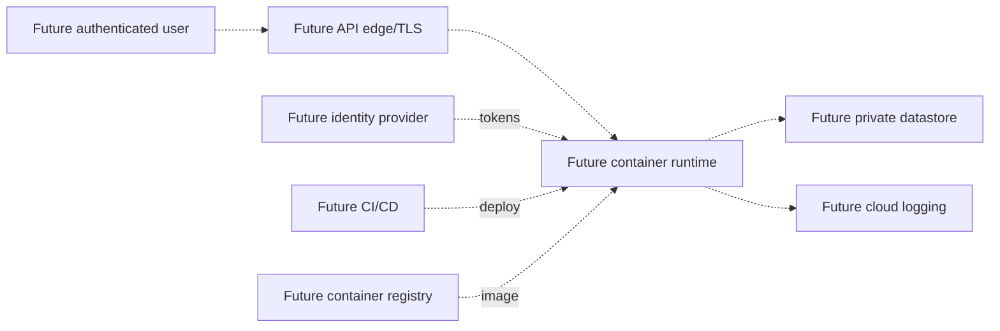
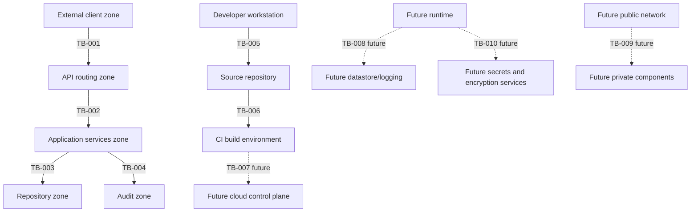

# Data Flow Diagrams

## Current Local Architecture

## Access-Request Workflow

## Approval and Rejection Workflow

## Audit-Event Flow

## Anticipated Cloud-Native Architecture

## Trust Boundaries

