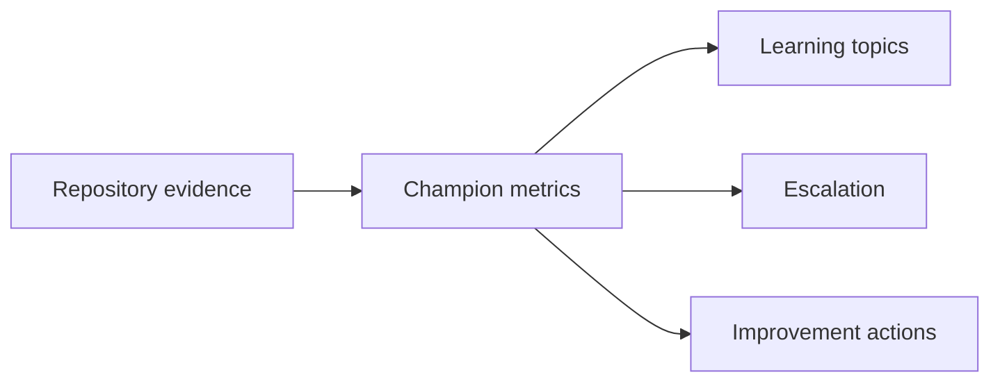

# Metrics

Metrics include champion coverage percentage, squads with active champion, squads without champion, onboarding completion, threat-model participation, secure-design participation, findings by squad, overdue findings by squad, critical and high findings by squad, owner-assignment rate, verification completion rate, exception review completion, repeated vulnerability categories, workshop completion, and action closure.

Metrics must reveal risk. They must not incentivise suppressing findings, avoiding scans, or hiding exceptions.

## How Champions Use This
Security Champions use this material to help squads ask better questions earlier, run the relevant repository commands, interpret evidence, and escalate risk with context. Champions do not approve formal risk acceptance, own incidents, weaken scanner policy, or replace Product Security accountability. Every activity should leave a clear evidence trail in the repository outputs or reports.

## Evidence
Use `make champions-full` after changing this material. Use `make findings-full`, `make release-full`, `make lifecycle-full`, `make evidence-full`, and `make developer-enablement-full` when the activity changes scanner findings, release decisions, lifecycle state, consolidated evidence, or developer guidance. Success means generated JSON evidence verifies and reports are regenerated from machine-readable data.

## Failure Mode
If evidence does not match the narrative, fix the evidence source or update the guidance. Do not hide findings, rename squads to avoid ownership, extend exceptions without review, or claim attendance that did not happen. Escalate unresolved risk with the relevant finding, release decision, lifecycle record, and proposed next action.
