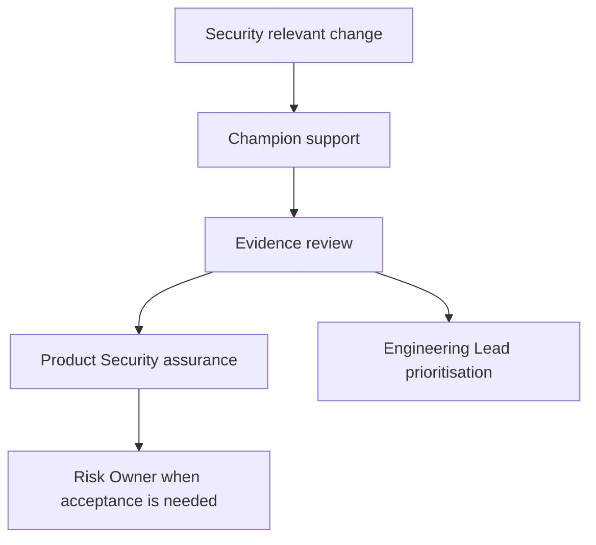

# Operating Model

The model connects Software Engineer, Security Champion, Engineering Lead, Product Security, Platform Engineering, Cloud Security, Technical Owner, and Risk Owner.

| Activity | Software Engineer | Security Champion | Engineering Lead | Product Security | Platform Engineering | Cloud Security | Technical Owner | Risk Owner |
| --- | --- | --- | --- | --- | --- | --- | --- | --- |
| Threat modelling | R | A | C | C | C | C | C | I |
| Secure design review | R | A | C | C | C | C | C | I |
| Scanner finding triage | R | A | C | C | C | C | C | I |
| Remediation ownership | A | C | C | I | R | R | C | I |
| Verification | R | C | I | A | C | C | C | I |
| Security exceptions | C | C | C | A | C | C | R | A |
| Release-gate review | C | C | I | A | C | C | R | A |
| Evidence review | R | C | I | A | C | C | C | I |
| Training | C | A | C | R | C | C | I | I |
| Escalation | R | A | A | A | C | C | C | A |

## How Champions Use This
Security Champions use this material to help squads ask better questions earlier, run the relevant repository commands, interpret evidence, and escalate risk with context. Champions do not approve formal risk acceptance, own incidents, weaken scanner policy, or replace Product Security accountability. Every activity should leave a clear evidence trail in the repository outputs or reports.

## Evidence
Use `make champions-full` after changing this material. Use `make findings-full`, `make release-full`, `make lifecycle-full`, `make evidence-full`, and `make developer-enablement-full` when the activity changes scanner findings, release decisions, lifecycle state, consolidated evidence, or developer guidance. Success means generated JSON evidence verifies and reports are regenerated from machine-readable data.

## Failure Mode
If evidence does not match the narrative, fix the evidence source or update the guidance. Do not hide findings, rename squads to avoid ownership, extend exceptions without review, or claim attendance that did not happen. Escalate unresolved risk with the relevant finding, release decision, lifecycle record, and proposed next action.
